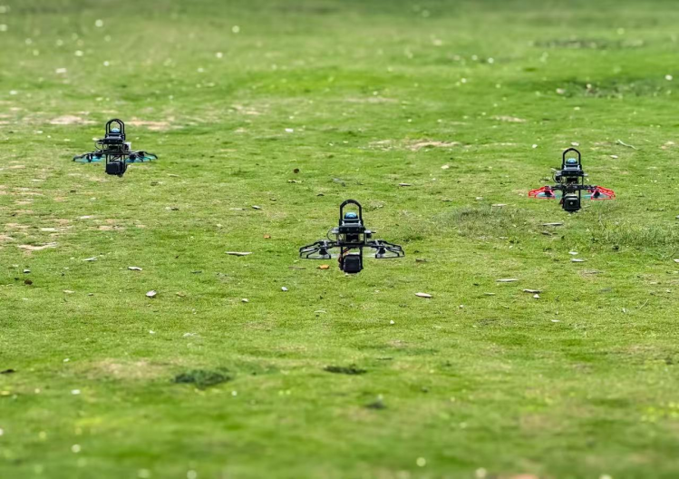
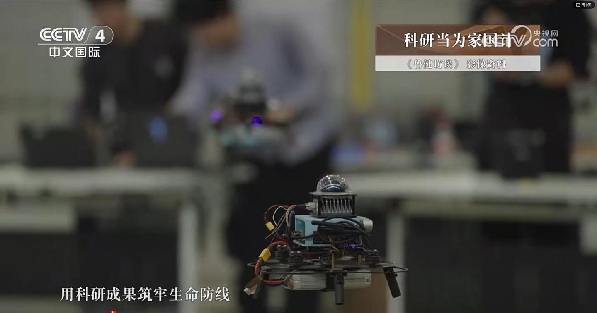
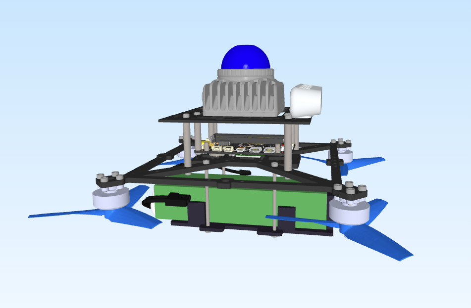
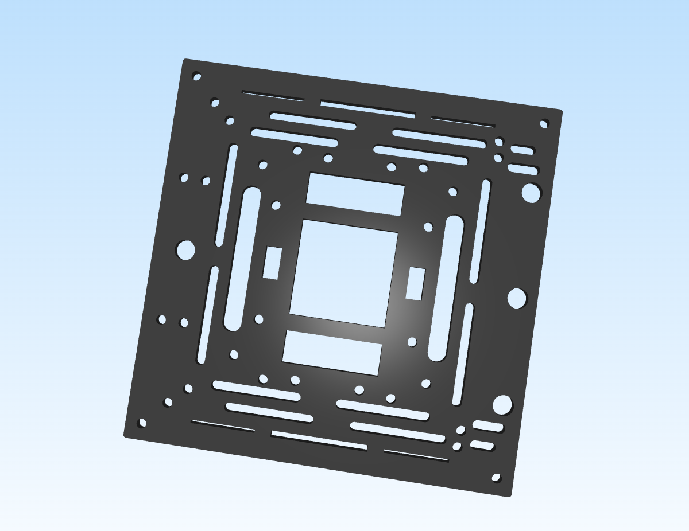
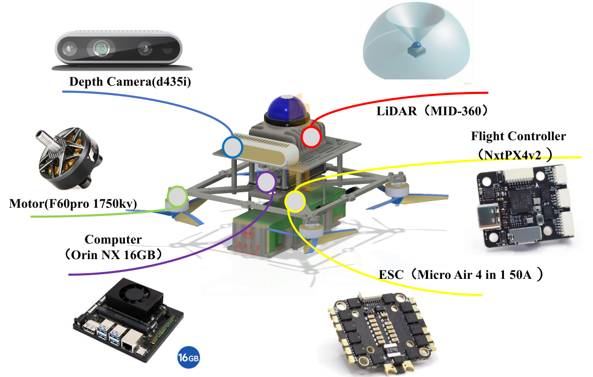
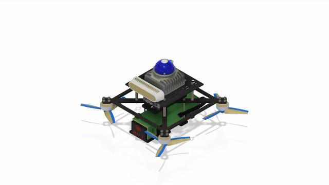

# HNU-Quadrotor

<figure>
    
    <figcaption>Three drones flying in the wild</figcaption>
</figure>
<figure>
    
    <figcaption>Design of the first generation of drones</figcaption>
</figure>

## Provided Materials

We provide the following resources:

* Editable drafts and assemblies [./hardware](./hardware)

| Caption               | Image Display                |
|-----------------------|------------------------------|
| UAV complete machine          |  |
| Battery compartment   |  |
| Top view              |                |
| Mounting plate        |     |

## Hardware Breakdown

The hardware structure is illustrated below:

## Bill of Materials

| Name                 | Type                          |
| -------------------- | ----------------------------- |
| LiDAR                | Livox MID360                  |
| Depth Camera         | Realsense D435i              |
| Onboard Computer     | Orin NX                   |
| Motor                | T-Motor F60 Pro KV1750            |
| Propeller            |  GEMFAN 5043                      |
| ESC                  | Micro Air  4 in 1   50A    |
| Battery              | DualSky 3300mAh 6S XP-3300HED |
| Flight Controller    | NxtPx4 v2                       |
| RC                   | Radiolink AT9S                |
| Receiver             | Radiolink R12DSM              |

## Acknowledgments
Special thanks to NxtPx4 for providing an excellent mini flight controller.
Gratitude to all contributors: Huidong Wang, Xingxunn  Dong, Minghe Chen, and Rongpei Dai.