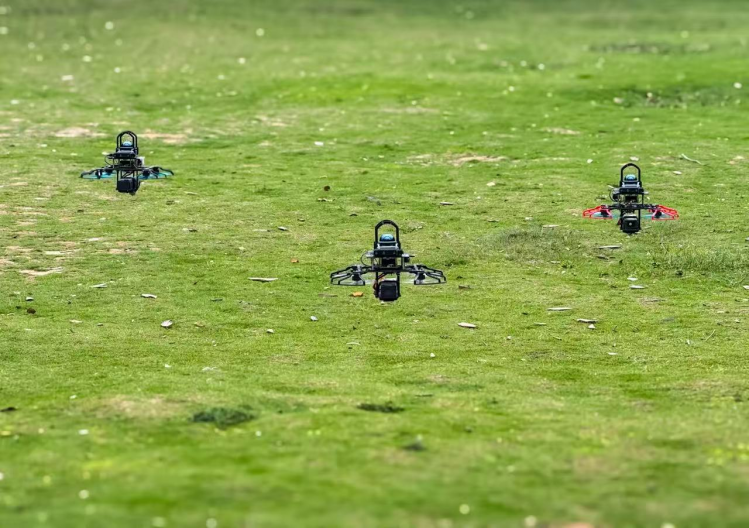
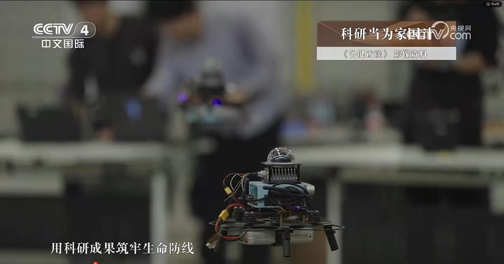
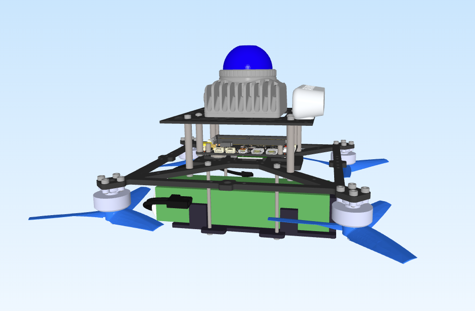
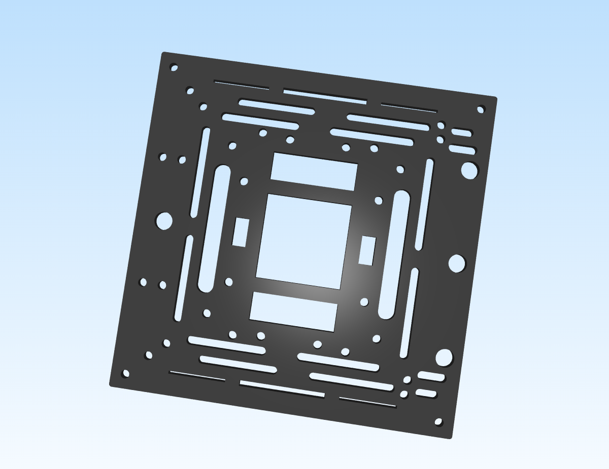
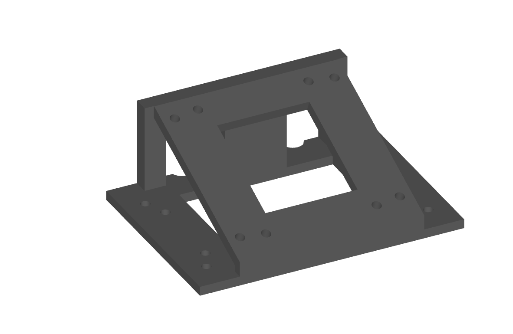
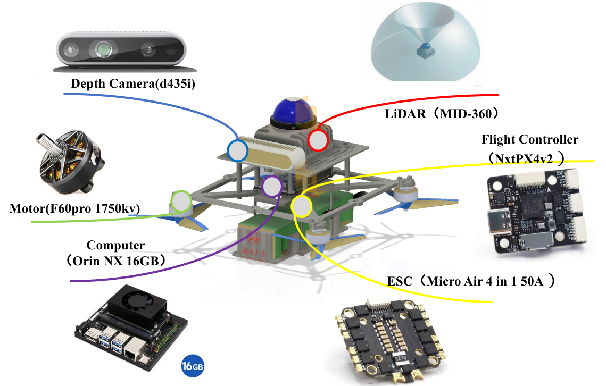
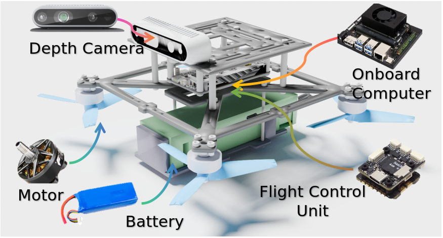
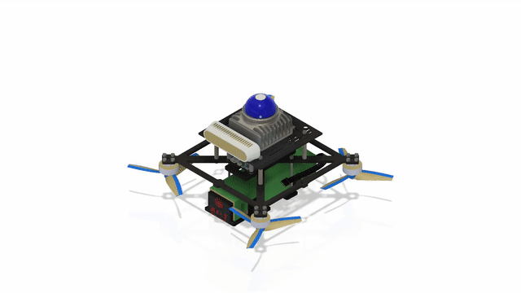
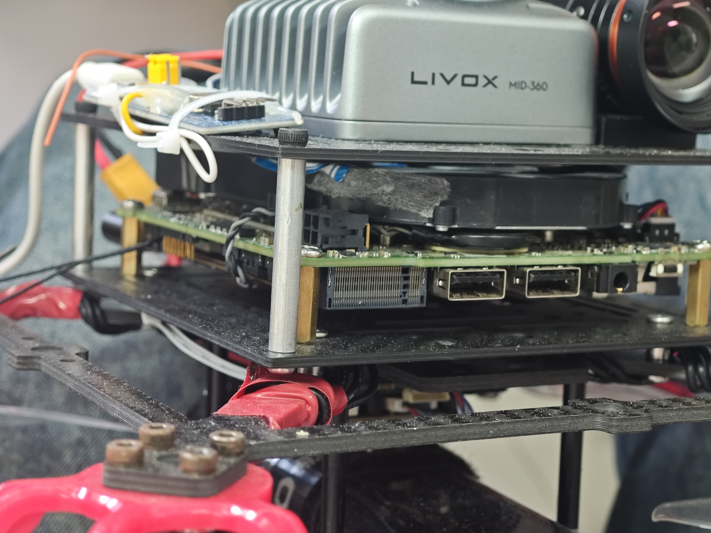

# HNU-Quadrotor

<figure>
    
    <figcaption>Three drones flying in the wild</figcaption>
</figure>

<figure>
    
    <figcaption>Design of the first generation of drones</figcaption>
</figure>

<figure>
    
    <figcaption>>Four drones flying indoors</figcaption>
</figure>

**Author：**[WHDworld](https://github.com/WHDworld), [XXLiu-HNU](https://github.com/XXLiu-HNU)

## Provided Materials

We provide the following resources:

* Editable drafts and assemblies [./hardware](./hardware)

| Caption               | Image Display                |
|-----------------------|------------------------------|
| UAV complete machine          |  |
| Battery compartment   |  |
| Top view              |                |
| Mounting plate        |     |
| LiDAR installation        |     |

## Hardware Breakdown

The hardware structure is illustrated below:

## Bill of Materials

| Name                 | Type                          |
| -------------------- | ----------------------------- |
| LiDAR                | Livox MID360                  |
| Depth Camera         | Realsense D435i              |
| Onboard Computer     | Orin NX                   |
| Motor                | T-Motor F60 Pro KV1750            |
| Propeller            |  GEMFAN 5043                      |
| ESC                  | Micro Air  4 in 1   50A    |
| Battery              | DualSky 3300mAh 6S XP-3300HED |
| Flight Controller    | NxtPx4 v2                       |
| RC                   | Radiolink AT9S                |
| Receiver             | Radiolink R12DSM              |

## Use NUC as Onboard Computer
If you want to use the NUC as an onboard computer, you only need to install an additional top plate.

## Optional sensor

To enhance flight stability and safety, especially in complex environments, we support the integration of additional sensors.

Optical Flow Sensor
We highly recommend adding an Optical Flow Sensor (e.g.,MTF-01) to the bottom of the airframe.

Safety Backup: In scenarios where primary positioning (GPS or LiDAR-SLAM) is lost or degrades, the optical flow sensor provides high-frequency velocity feedback.

Fly-away Prevention: This ensures the drone can maintain a stable hover and prevents the aircraft from drifting or "flying away" due to state estimation failure.

## Acknowledgments

When designing, we referred to the [super-hardware](https://github.com/hku-mars/SUPER-Hardware), [UniQuad](https://github.com/HKUST-Aerial-Robotics/UniQuad), [Fast-Drone-250](https://github.com/ZJU-FAST-Lab/Fast-Drone-250) projects and would like to express our sincere gratitude for this.

Gratitude to all contributors: Huidong Wang, Xingxun  Liu, Shaojie Li.

## Contact Us

If you have any questions about hardware or any other questions you want to consult, please contact us: liuxingxun@hnu.edu.cn
